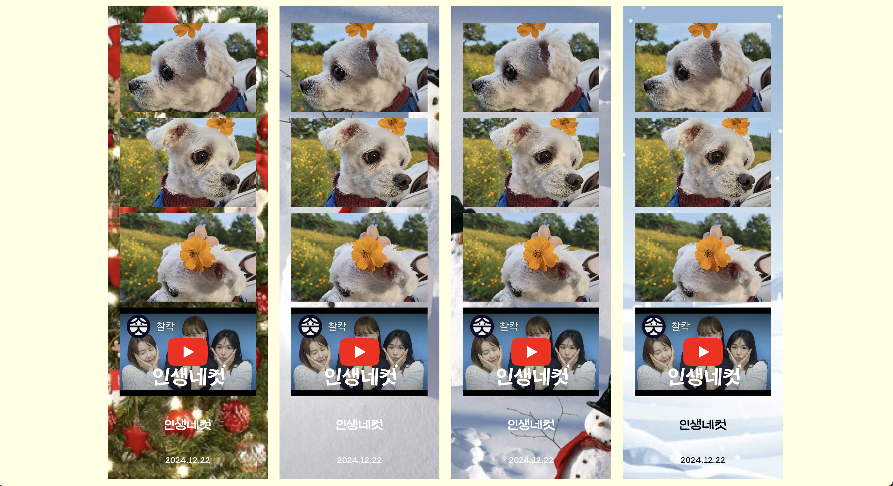

### 📸 나만의 네컷 (인생네컷)

안녕하세요! 😊 이 프로젝트는 HTML을 사용해 '나만의 네컷' 웹 페이지를 제작한 것입니다. 네 컷 사진과 함께 유튜브 비디오를 포함하여 기억에 남는 순간들을 간직할 수 있는 간단한 웹 페이지입니다.

---

## 🖼️ 주요 기능
1. **네 컷 구성**  
   - 각각의 네 컷 사진은 이미지 파일과 함께 표시됩니다.
   - 네 번째 영역에는 유튜브 비디오가 삽입됩니다.  

2. **반응형 디자인**  
   - 외부 CSS 파일(`my4cut_style.css`)을 연동하여 보기 좋은 스타일을 적용했습니다.  

3. **반복적인 레이아웃**  
   - 네 컷 구성은 필요에 따라 여러 개의 컨테이너로 반복 가능합니다.

---

## 🔧 사용된 기술
- **HTML5**  
  문서 구조와 콘텐츠 작성에 사용되었습니다.
- **CSS3**  
  스타일링을 위해 외부 스타일 파일이 연동되었습니다.
- **YouTube Embed**  
  유튜브 iframe을 사용해 동영상을 삽입했습니다.

---

## 🌟 프로젝트 구조
```
📂 프로젝트 폴더
├── 📂 css
│   └── my4cut_style.css
│   └── style.css
│   └── class_style.css
├── 📂 img
│   ├── image1~4.png
│   ├── bg_1~4.png
│   ├── 네컷 배경.zip
│   ├── 네컷 이미지 4개.zip
├── index.html
├── class.html
├── my4cut.html
```

---

## 🖥️ 미리보기  


---

## 🚀 실행 방법
1. 이 레포지토리를 클론하거나 다운로드합니다.
   ```bash
   git clone https://github.com/your-repository/my4cut.git
   ```
2. 프로젝트 폴더로 이동합니다.
   ```bash
   cd my4cut
   ```
3. 브라우저로 `index.html` 파일을 열어 웹 페이지를 확인합니다.

---

## 📧 문의
궁금한 점이나 제안사항이 있다면 언제든지 연락주세요! 💌  
**Email**: ddah0329m@gmail.com  
**GitHub**: [Your GitHub](https://github.com/ddah0329)
